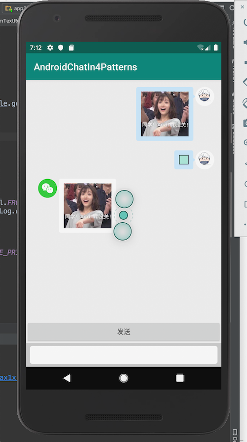

# 报告

## 实现思路

1. 使用正则表达式匹配 markdown 的图片格式字符串
2. 将所有形如 `` 都替换成 `html` 标签 `` 的形式
3. 创建自定义的 `ImageGetter` 用来解析 `img` 标签
4. 使用 `TextView` 的 `textView.setText(Html.fromHtml(…))` 进行渲染

## 屏幕截图

## 其他说明

- 额外添加的库
  - Goggle Volley 用来请求图片
- 